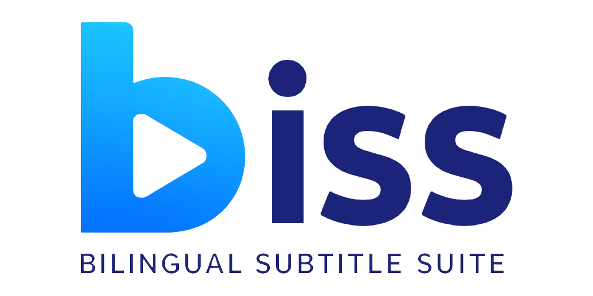

# Bilingual Subtitle Suite



A sophisticated Python application for processing, aligning, and merging subtitle files with advanced bilingual subtitle creation capabilities. Supports multiple language combinations including Chinese-English, Japanese-English, Korean-English, and more, with intelligent track selection, translation-assisted alignment, and comprehensive video container support.

## 📺 Example Output


*Example of bilingual Chinese-English subtitles created by Bilingual Subtitle Suite*

## 🌟 Key Features

### 🎬 Advanced Bilingual Subtitle Creation
- **Intelligent Track Selection**: Automatically identifies main dialogue tracks vs forced/signs tracks
- **Enhanced Alignment System**: Two-phase alignment with global synchronization and detailed event matching
- **Translation-Assisted Alignment**: Google Cloud Translation API integration for semantic matching
- **Manual Synchronization Interface**: Interactive anchor point selection with millisecond precision
- **Cross-Language Support**: Chinese, Japanese, Korean, and other languages with English

### 🔧 Comprehensive Processing Pipeline
- **Video Container Integration**: Extract and process embedded subtitles from MKV, MP4, AVI containers
- **Multiple Format Support**: SRT, ASS, VTT, and PGS (via OCR conversion)
- **Encoding Conversion**: UTF-8 conversion with automatic encoding detection
- **Batch Processing**: Automated multi-file workflows with confirmation options
- **Backup Management**: Automatic backup creation with cleanup utilities

### 🎯 PGS Subtitle Conversion
- **OCR Integration**: Tesseract OCR with Chinese (Simplified/Traditional) and English support
- **Cross-Platform Setup**: Automated installation for Windows, Linux, and macOS
- **Intelligent Activation**: PGS conversion as fallback when no text-based subtitles available
- **Self-Contained Installation**: Clean repository with no bundled dependencies
- **Powered by PGSRip**: Integration with [PGSRip by ratoaq2](https://github.com/ratoaq2/pgsrip) for reliable PGS extraction

### 🖥️ Dual Interface System
- **Command-Line Interface**: Extensive CLI with 20+ options for automation
- **Interactive Mode**: User-friendly menu system with guided workflows
- **Feature Parity**: All capabilities available in both interfaces

## 🚀 Quick Start

### Prerequisites
- **Python 3.8+** (Python 3.10+ recommended)
- **FFmpeg** (for video container processing)
- **Git** (for installation)

### Installation
```bash
# Clone the repository
git clone <repository-url>
cd chsub

# Install Python dependencies
pip install -r requirements.txt

# Verify installation
python biss.py --version
```

### Basic Usage
```bash
# Interactive mode (recommended for beginners)
python biss.py

# Create bilingual subtitles from video file
python biss.py merge movie.mkv

# Process with enhanced alignment
python biss.py merge movie.mkv --auto-align --manual-align

# Batch process entire directory
python biss.py batch-merge "Season 01" --auto-confirm
```

### Optional: PGS Subtitle Conversion
```bash
# One-command setup for PGS conversion
python biss.py setup-pgsrip install

# Convert PGS subtitles to SRT
python biss.py convert-pgs movie.mkv --language chi_sim
```

## 📖 Documentation

### Complete Documentation
- **[CLI Reference](docs/cli-reference.md)** - Complete command-line interface documentation
- **[Interactive Mode Guide](docs/interactive-guide.md)** - Step-by-step interactive interface guide
- **[Advanced Features](docs/advanced-features.md)** - Enhanced alignment, translation integration, manual sync
- **[PGS Conversion](docs/pgs-conversion.md)** - PGS subtitle conversion setup and usage
- **[Real-World Examples](docs/examples.md)** - Practical usage scenarios and workflows
- **[Troubleshooting](docs/troubleshooting.md)** - Common issues and solutions
- **[API Documentation](docs/api-reference.md)** - Developer reference for extending functionality

### Quick Reference

#### Basic Commands
```bash
# Interactive mode
python biss.py

# Merge subtitles from video
python biss.py merge movie.mkv

# Enhanced alignment with manual control
python biss.py merge movie.mkv --auto-align --manual-align

# Translation-assisted alignment
python biss.py merge movie.mkv --auto-align --use-translation

# Batch processing
python biss.py batch-merge "Season 01" --auto-confirm
```

#### Advanced Features
```bash
# Manual synchronization interface
python biss.py merge movie.mkv --manual-align --sync-strategy manual

# High-precision alignment
python biss.py merge movie.mkv --auto-align --alignment-threshold 0.95

# PGS conversion integration
python biss.py merge movie.mkv --force-pgs

# Bulk alignment (non-combined)
python biss.py batch-align /media/subtitles --reference-language en
```

## 🏗️ Architecture

### Project Structure
```
BilingualSubtitleSuite/
├── biss.py                          # Main application entry point
├── docs/                           # Comprehensive documentation
├── core/                           # Core processing modules
│   ├── subtitle_formats.py         # Format parsing (SRT, ASS, VTT)
│   ├── video_containers.py         # Video container handling
│   ├── track_analyzer.py           # Intelligent track analysis
│   ├── language_detection.py       # Language identification
│   └── translation_service.py      # Translation API integration
├── processors/                     # High-level workflows
│   ├── merger.py                   # Bilingual subtitle merging
│   ├── converter.py                # Encoding conversion
│   ├── realigner.py                # Subtitle alignment
│   ├── batch_processor.py          # Batch operations
│   └── bulk_aligner.py             # Bulk alignment workflows
├── ui/                            # User interfaces
│   ├── cli.py                     # Command-line interface
│   ├── interactive.py             # Interactive menu system
│   └── manual_sync.py             # Manual synchronization interface
├── utils/                         # Utility modules
│   ├── file_operations.py         # File management
│   ├── backup_manager.py          # Backup utilities
│   └── logging_config.py          # Logging configuration
└── third_party/                  # Third-party integrations
    ├── pgsrip_wrapper.py          # PGS conversion integration
    ├── setup_pgsrip.py            # Automated PGS setup
    └── pgsrip_install/            # Auto-downloaded components
```

### Supported Formats
- **Video**: MKV, MP4, AVI, M4V, MOV, WebM, TS, MPG
- **Subtitles**: SRT, ASS/SSA, VTT, PGS (via OCR)
- **Encodings**: UTF-8, UTF-16, GB18030, GBK, Big5, Shift-JIS
- **Languages**: Chinese (Simplified/Traditional), English, Japanese, Korean

## 🎯 Real-World Examples

### Anime Processing
```bash
# Basic anime episode with embedded English and external Chinese
python biss.py merge "Made in Abyss S02E01.mkv"
# Output: Made in Abyss S02E01.zh-en.srt

# Complex timing issues requiring manual alignment
python biss.py merge "Made in Abyss S02E02.mkv" --auto-align --manual-align
```

### Movie Processing
```bash
# Movie with PGS subtitles
python biss.py merge "Batman Ninja (2018).mkv" --force-pgs --language chi_sim

# High-precision alignment for critical content
python biss.py merge "important-movie.mkv" \
  --auto-align --manual-align --use-translation --alignment-threshold 0.95
```

### Batch Operations
```bash
# Process entire TV season
python biss.py batch-merge "Season 01" --auto-align --auto-confirm

# Convert all subtitle files to UTF-8
python biss.py batch-convert /media/subtitles --encoding utf-8 --backup
```

## 🔧 Configuration

### Environment Variables
```bash
# Google Translation API (optional)
export GOOGLE_TRANSLATE_API_KEY="your-api-key"

# Custom FFmpeg timeout (default: 900 seconds)
export FFMPEG_TIMEOUT=1800
```

### CLI Configuration
- **Alignment Threshold**: `--alignment-threshold 0.8` (0.0-1.0)
- **Time Matching Window**: `--time-threshold 0.5` (seconds)
- **Translation Limit**: `--translation-limit 10` (API calls per alignment)
- **Sync Strategy**: `--sync-strategy auto|first-line|scan|translation|manual`

## 🚨 Troubleshooting

### Quick Fixes
```bash
# Debug mode for detailed logging
python biss.py --debug merge movie.mkv

# Check system dependencies
python biss.py --version

# Verify PGS setup
python biss.py setup-pgsrip check
```

### Common Issues
- **FFmpeg not found**: Install FFmpeg and add to PATH
- **Encoding detection fails**: `pip install charset-normalizer`
- **Translation errors**: Verify API key and internet connection
- **Manual interface not responding**: Use PowerShell instead of Command Prompt

## 🙏 Acknowledgments

### Third-Party Integrations

**PGS Subtitle Conversion**: This project integrates [PGSRip by ratoaq2](https://github.com/ratoaq2/pgsrip) for PGS (Presentation Graphic Stream) subtitle extraction and conversion. PGSRip is an excellent tool that enables reliable extraction of image-based subtitles from video containers. We gratefully acknowledge ratoaq2's work in making PGS subtitle processing accessible.

**OCR Technology**: Powered by [Tesseract OCR](https://github.com/tesseract-ocr/tesseract) for optical character recognition with multi-language support.

**Video Processing**: Built on [FFmpeg](https://ffmpeg.org/) for robust video container handling and subtitle track extraction.

### Third-Party Licenses
- **PGSRip**: Licensed under Apache License 2.0 - see [PGSRip repository](https://github.com/ratoaq2/pgsrip) for details
- **Tesseract OCR**: Licensed under Apache License 2.0
- **FFmpeg**: Licensed under LGPL/GPL depending on configuration