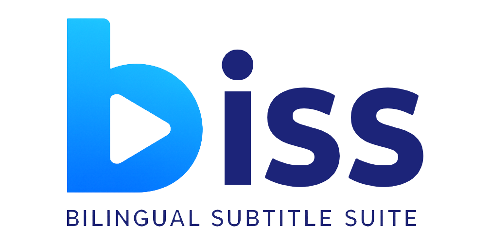

# Bilingual Subtitle Suite (BISS)



A powerful toolkit for creating bilingual subtitles from video files and standalone subtitle files. Supports Chinese-English, Japanese-English, Korean-English and other language combinations with automatic language detection, intelligent track selection, and timing alignment.

**[Gitee Mirror (中国镜像)](https://gitee.com/kawadean/bilingual-subtitle-suite)** | **[中文文档](README.zh.md)**

## Download

Download the latest release from the [GitLab Releases](https://gitlab.kawalink.com/dean/Bilingual-Subtitle-Suite/-/releases) page. Releases are now built and published on GitLab only; v2.2.1 and earlier are also on [GitHub Releases](https://github.com/Deenyoro/Bilingual-Subtitle-Suite/releases).

| File | Description | Approx. Size |
|------|-------------|--------------|
| **`biss.exe`** | Lite build — all features except PGS OCR | ~20 MB |
| **`biss-full.exe`** | Full build — includes PGS OCR with bundled Tesseract data (eng, chi_sim, chi_tra, jpn, kor) | ~110 MB |

> **Which one should I download?**
> Most users should start with **`biss.exe`**. It handles subtitle merging, alignment, encoding conversion, batch processing, and the full GUI/CLI. Download **`biss-full.exe`** only if you need to convert PGS (Blu-ray image-based) subtitles to text via OCR.

## Example Output


*Bilingual Chinese-English subtitles created by BISS*

## Features

### Bilingual Subtitle Creation
- **Automatic Language Detection**: Identifies languages from filenames and content analysis
- **Smart Track Selection**: Distinguishes main dialogue from forced/signs-only tracks
- **Timing Alignment**: Handles timing differences between tracks automatically
- **Translation-Assisted Matching**: Optional Google Cloud Translation API for semantic alignment
- **Multiple Language Support**: Chinese, Japanese, Korean paired with English

### Processing Capabilities
- **Video Container Support**: Extract embedded subtitles from MKV, MP4, AVI, MOV, WebM, TS
- **Subtitle Formats**: SRT, ASS/SSA, VTT input and output
- **PGS Conversion**: OCR-based conversion of image subtitles (full build or system Tesseract)
- **Encoding Conversion**: Automatic detection and UTF-8 conversion
- **Timing Adjustment**: Shift subtitles by offset or set specific start times
- **Batch Processing**: Process entire directories with single commands

### User Interfaces
- **Graphical Interface**: Full-featured GUI with drag-and-drop, preview, and visual feedback
- **Command Line**: Scriptable CLI with comprehensive options
- **Interactive Mode**: Menu-driven text interface for guided workflows

## Installation from Source

> **Note:** If you downloaded a pre-built exe from the [Releases](https://gitlab.kawalink.com/dean/Bilingual-Subtitle-Suite/-/releases) page, skip this section. Just run the exe directly — no Python or pip required.

### Requirements
- Python 3.8 or higher (3.10+ recommended)
- FFmpeg installed and available in PATH
- Git (for cloning)

### Setup
```bash
git clone https://github.com/Deenyoro/Bilingual-Subtitle-Suite.git
cd chsub
pip install -r requirements.txt

# Verify installation
biss --version
# Or, if running from source:
python biss.py --version
```

### Optional: PGS Subtitle Conversion
```bash
biss setup-pgsrip install
```

## Usage

> **Running from source?** Substitute `python biss.py` wherever you see `biss` below.

### Multi-Language UI
```bash
biss --lang zh          # Chinese interface (中文界面)
biss --lang ja          # Japanese interface (日本語)
biss --lang ko          # Korean interface (한국어)
```
The app auto-detects your system language. Set `BISS_LANG=zh` as an environment variable for persistent selection.

### Graphical Interface (Recommended for Beginners)
```bash
biss gui
# Or simply:
biss
```

The GUI provides:
- Tabbed interface for Merge, Shift, Convert, and Batch operations
- File preview with Ctrl+P
- Automatic language detection labels
- Quick offset buttons for timing adjustment
- Real-time operation logging

### Command Line

**Merge subtitles from two files:**
```bash
biss merge chinese.srt english.srt
```
Languages are detected automatically from filenames (.zh, .chi, .en, .eng, etc.) or content.

**Extract and merge from video:**
```bash
biss merge movie.mkv
```
Extracts embedded Chinese and English tracks and creates bilingual output.

**Shift subtitle timing:**
```bash
# Shift back 2.5 seconds
biss shift subtitle.srt --offset="-2.5s"

# Shift forward 500 milliseconds
biss shift subtitle.srt --offset 500ms

# Set first subtitle to specific timestamp
biss shift subtitle.srt --first-line-at "00:01:23,456"
```

**Convert encoding:**
```bash
biss convert subtitle.srt
```
Automatically detects encoding and converts to UTF-8.

**Preview changes without executing:**
```bash
biss --dry-run merge chinese.srt english.srt
```

**Batch operations:**
```bash
# Merge all videos in directory
biss batch-merge "Season 01" --auto-confirm

# Convert all subtitles to UTF-8
biss batch-convert /path/to/subtitles --recursive
```

### Interactive Mode
```bash
biss interactive
```
Presents a menu-driven interface for all operations.

## Advanced Options

### Alignment for Timing Mismatches
When subtitle tracks have different timing:
```bash
biss merge movie.mkv --auto-align
```

For large timing offsets (50+ seconds):
```bash
biss merge movie.mkv --auto-align --alignment-threshold 0.3
```

With translation assistance for better cross-language matching:
```bash
biss merge movie.mkv --auto-align --use-translation
```

### Track Selection
```bash
# List available tracks
biss merge movie.mkv --list-tracks

# Force specific track IDs
biss merge movie.mkv --chinese-track 3 --english-track 5

# Prefer external files over embedded
biss merge movie.mkv --prefer-external
```

### Output Control
```bash
# Specify output path
biss merge file1.srt file2.srt -o output.srt

# Choose output format
biss merge file1.srt file2.srt --format ass
```

## Project Structure

```
biss/
├── biss.py                    # Main entry point
├── build.py                   # Build script for Windows exe
├── biss.spec                  # PyInstaller spec file
├── core/                      # Core processing modules
│   ├── subtitle_formats.py    # SRT, ASS, VTT parsing
│   ├── video_containers.py    # FFmpeg integration
│   ├── language_detection.py
│   ├── encoding_detection.py
│   ├── similarity_alignment.py
│   ├── translation_service.py
│   ├── track_analyzer.py
│   ├── ass_converter.py
│   └── timing_utils.py
├── processors/                # High-level operations
│   ├── merger.py              # Bilingual merging
│   ├── converter.py           # Encoding conversion
│   ├── timing_adjuster.py     # Timing adjustment
│   ├── realigner.py           # Subtitle alignment
│   ├── splitter.py            # Bilingual splitting
│   ├── bulk_aligner.py        # Bulk alignment
│   └── batch_processor.py     # Batch operations
├── ui/                        # User interfaces
│   ├── gui.py                 # Tkinter GUI
│   ├── cli.py                 # Command-line interface
│   └── interactive.py         # Interactive text mode
├── utils/                     # Utilities
│   ├── constants.py           # Shared constants
│   ├── backup_manager.py      # Backup handling
│   ├── file_operations.py
│   └── logging_config.py
└── third_party/               # External integrations
    └── pgsrip_wrapper.py      # PGS conversion
```

## Supported Formats

| Type | Formats |
|------|---------|
| Video | MKV, MP4, AVI, M4V, MOV, WebM, TS, MPG, MPEG |
| Subtitles | SRT, ASS, SSA, VTT |
| Encodings | UTF-8, UTF-16, GB18030, GBK, Big5, Shift-JIS, and more |
| Languages | Chinese (Simplified/Traditional), English, Japanese, Korean |

## Configuration

### Environment Variables
```bash
# Google Translation API key (optional, for --use-translation)
export GOOGLE_TRANSLATE_API_KEY="your-api-key"

# FFmpeg timeout in seconds (default: 900)
export FFMPEG_TIMEOUT=1800
```

### Backup Management
Backups are created automatically when modifying files in-place. The backup manager keeps the 5 most recent backups per file by default.

```bash
# Clean up old backups
biss cleanup-backups /path/to/directory --older-than 30
```

## Building / Releases (GitLab CI)

The GitLab pipeline (`.gitlab-ci.yml`) builds both Windows executables on the
self-hosted Windows runner and publishes them as a GitLab release. The release
appears under **Deploy → Releases** of the GitLab project, and the files are
stored in its **Package Registry** (generic package `biss`, one version per
release):

| File | What it is |
|------|------------|
| `biss.exe` | Lite build (`python build.py --lite`): everything except PGS OCR |
| `biss-full.exe` | Full build (`python build.py --output-name biss-full`): adds the PGSRip package and Tesseract data for `eng`, `chi_sim`, `chi_tra`, `jpn`, `kor` |

What the pipeline does:

- **test** (Linux container, Python 3.11): `python -m unittest discover -s tests`,
  with the GUI tests running under Xvfb. For a release, it also checks that
  `APP_VERSION` in `utils/constants.py` equals the tag's version and that
  `CHANGELOG.md` has a `## [X.Y.Z]` entry.
- **build-windows-lite / build-windows-full** (Windows runner): Python 3.11.9
  with Tk 8.6, installed once on the runner by `ci/tools-windows.ps1` from
  pinned, SHA-256-checked downloads. The packages come from
  `ci/requirements-build.txt` (PyInstaller pinned). The full build first runs
  `ci/prepare-full-windows.ps1`, which lays out `third_party/pgsrip_install/`
  (tessdata from tesseract-ocr/tessdata tag 4.1.0, SHA-256-pinned;
  `pgsrip==0.2.1`, hash-pinned; `pgsrip_config.json`). `ci/check-exe.ps1` then
  runs each exe's `--version` and `--help` and checks a minimum size, and for a
  release it checks that the exe reports the release's version.
- **release** (only on `v*` tags or with `RELEASE_VERSION`): uploads both exes
  to the Package Registry and creates or updates the GitLab release for the tag.

**Cutting a release:** set `APP_VERSION` in `utils/constants.py` to `X.Y.Z`,
add a `## [X.Y.Z]` section to `CHANGELOG.md`, commit, then push the tag
`vX.Y.Z` (for example `git tag v2.3.0 && git push origin v2.3.0`). To rebuild
or re-publish an existing tag, run the pipeline from the web UI (**Build →
Pipelines → Run pipeline**) **with the tag `vX.Y.Z` as the ref** and the
variable `RELEASE_VERSION=vX.Y.Z`. The test job refuses a run whose ref is not
that tag. The release job refuses to publish if the tag points at a different
commit from the one the pipeline built. A web/API run without
`RELEASE_VERSION` only tests and builds; the exes can then be downloaded from
the job artifacts, which are kept for 30 days. The pipeline does not run on
ordinary pushes or merge requests.

GitHub Actions is disabled for this project: releases are built and published
on GitLab only. `.github/workflows/release.yml` is kept for reference and does
not run.

**Artifact size limit:** `biss-full.exe` is about 110 MB, which is more than
GitLab's default 100 MB maximum artifact size. Before the first run, an admin
must set **Maximum artifacts size** to at least 150 MB (Admin → Settings →
CI/CD for the instance, or the project's CI/CD settings). Otherwise
`build-windows-full` fails to upload its artifact (HTTP 413) and the release
job cannot run.

**Difference from the GitHub build:** the GitHub workflow pip-installed
`pgsrip` and its dependencies into the build environment, so PyInstaller saw
them during analysis. Here `pgsrip` is only unpacked into
`third_party/pgsrip_install/` (without dependencies), and `build.py` bundles
that folder as data, as before. The frozen module graph, and so the size of
`biss-full.exe`, can differ slightly. Runtime behaviour is the same, because
`pgsrip` imports `numpy`, which `build.py` excludes in both builds.

**Building locally** (Windows, Python 3.11 with Tk):

```bash
pip install -r ci/requirements-build.txt
python build.py --lite                      # dist/biss.exe
python build.py --output-name biss-full     # dist/biss-full.exe (bundles third_party/pgsrip_install/ if present)
python -m unittest discover -s tests        # on Linux: xvfb-run -a python -m unittest discover -s tests
```

## Troubleshooting

### Common Issues

**FFmpeg not found:**
Install FFmpeg and ensure it's in your system PATH. Test with `ffmpeg -version`.

**Encoding detection fails:**
```bash
pip install charset-normalizer
```

**Garbled characters in output:**
The source file may have incorrect encoding. Try:
```bash
biss convert subtitle.srt --force
```

**Timing mismatch after merge:**
Use alignment options:
```bash
biss merge file1.srt file2.srt --auto-align
```

### Debug Mode
For detailed logging:
```bash
biss --debug merge movie.mkv
```

## Author

Dean Thomas ([@Deenyoro](https://github.com/Deenyoro))

## Acknowledgments

This project integrates several excellent open-source tools:

- **[PGSRip](https://github.com/ratoaq2/pgsrip)** by ratoaq2 - PGS subtitle extraction (Apache 2.0)
- **[Tesseract OCR](https://github.com/tesseract-ocr/tesseract)** - Optical character recognition (Apache 2.0)
- **[FFmpeg](https://ffmpeg.org/)** - Video/audio processing (LGPL/GPL)

## License

This project is licensed under the [Apache License 2.0](LICENSE).
